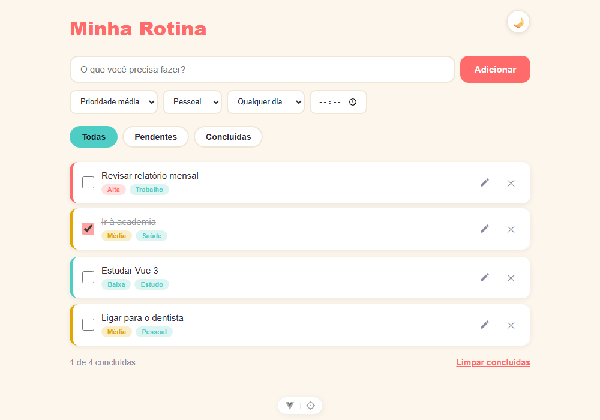

# Minha Rotina

Aplicação de lista de tarefas (to-do list) construída com Vue 3, TypeScript e Pinia. Permite criar tarefas com prioridade, categoria e agendamento (dia da semana / horário), marcar como concluídas, editar, filtrar e alternar entre tema claro e escuro.

Link do site: https://projeto-minha-rotina-xp2t.vercel.app/



## Funcionalidades

- Criar tarefas com texto, prioridade (baixa/média/alta), categoria (trabalho, casa, saúde, estudo, pessoal, outro) e agendamento opcional (dia da semana e horário)
- Marcar/desmarcar tarefas como concluídas
- Editar o texto de uma tarefa existente
- Filtrar por todas, pendentes ou concluídas
- Limpar todas as tarefas concluídas de uma vez
- Alternar entre tema claro e escuro

## Tecnologias

- [Vue 3](https://vuejs.org/) (Composition API + `<script setup>`)
- [TypeScript](https://www.typescriptlang.org/)
- [Vite](https://vite.dev/)
- [Pinia](https://pinia.vuejs.org/) para gerenciamento de estado
- [Vue Router](https://router.vuejs.org/)
- [ESLint](https://eslint.org/) + [oxlint](https://oxc.rs/) + [Prettier](https://prettier.io/)

## Como executar

Pré-requisitos: Node.js `^20.19.0` ou `>=22.12.0`.

```sh
npm install
```

### Ambiente de desenvolvimento (hot-reload)

```sh
npm run dev
```

### Build de produção

```sh
npm run build
```

### Lint

```sh
npm run lint
```

### Formatação

```sh
npm run format
```

## Estrutura do projeto

```
src/
├── App.vue                # Layout raiz e botão de troca de tema
├── router/                 # Configuração das rotas
├── composables/             # Composables reutilizáveis (ex.: useTheme)
└── modules/
    └── Tasks/
        ├── TasksView.vue              # Tela principal de tarefas
        ├── components/                # Componentes da tela de tarefas
        ├── store/                     # Store Pinia de tarefas
        ├── services/                  # Regras de negócio/acesso a dados
        ├── entities/ e interfaces/    # Tipos e modelos de tarefa
        └── route.ts                   # Rota do módulo
```

> Termos e nomes usados no código (variáveis, tipos, componentes) são mantidos em inglês; todo o texto exibido ao usuário na interface está em português.
